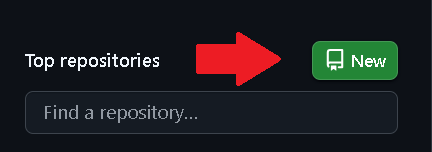
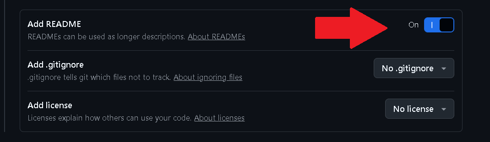
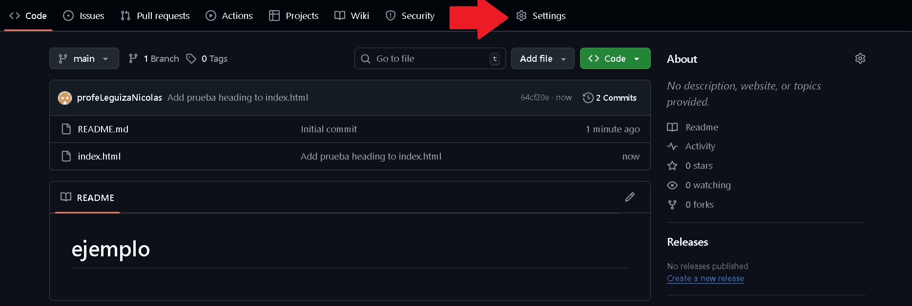
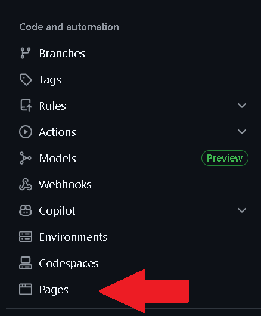

<div style="text-align: justify">

# Hostear en `GitHub`.

1. Creá un nuevo repositorio en `GitHub` (por ejemplo: **mi-pagina**).

<div style="text-align: center">



</div>

<div style="text-align: center">
  


</div>

3. Subí tus archivos - Por ejemplo:

```diff
index.html
style.css
main.js
```

3. Entrá a la pestaña `Setting` del repositorio.

<div style="text-align: center">



</div>

4. Bajá hasta la sección `Pages` (en el menú lateral).

<div style="text-align: center">



</div>

5. En `Source`, elegí la rama (por lo general **main**) y la carpeta **/ (root)** o **/docs** según donde tengas los archivos.

<div style="text-align: center">


</div>

<div style="text-align: center">


</div>

6. Guardá los cambios `Save`.

<div style="text-align: center">


</div>

<fieldset>
<legend>

`GitHub` generará una URL como:

</legend>

```diff
https://tu-usuario.github.io/mi-pagina/
```

</fieldset>

Tu archivo `index.html` será la página de inicio.


</div>


